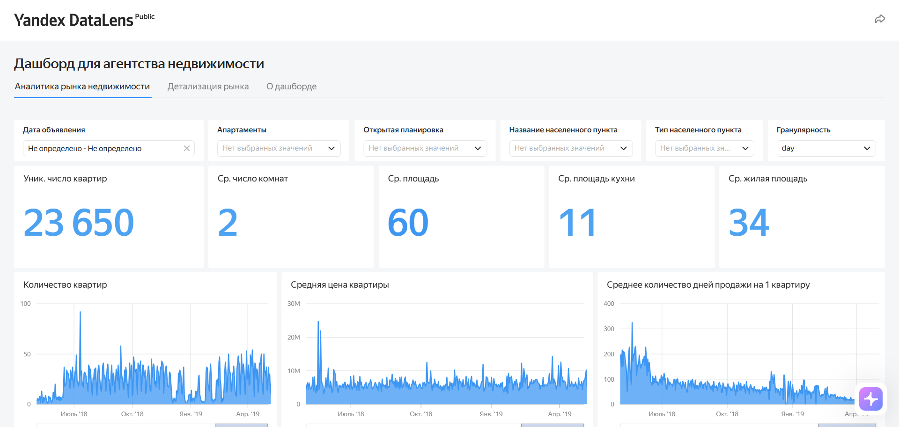
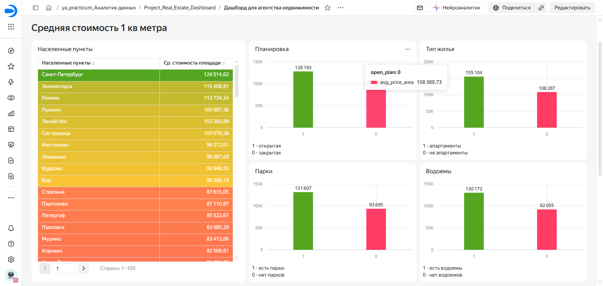
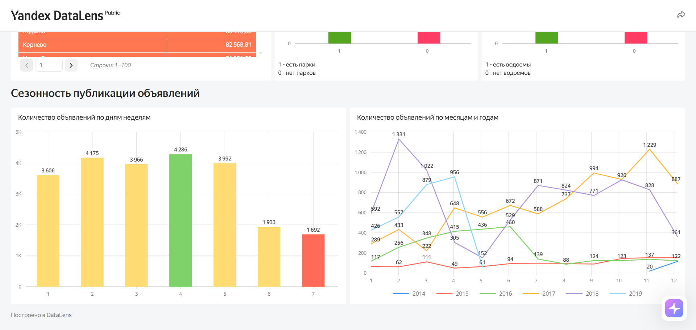

# Анализ рынка недвижимости Санкт-Петербурга и Ленинградской области

Учебный исследовательский проект по анализу объявлений о продаже жилой недвижимости  
в Санкт-Петербурге и Ленинградской области.  
Цель — помочь агентству недвижимости из Петрозаводска выйти на новый рынок:  
выбрать перспективные сегменты, понять сезонность и спланировать бизнес-стратегию.

**Автор:** Oleg Doronin ([@Logos-AOD](https://github.com/Logos-AOD))  

**Направление:** Data Analyst

**Email:** doroninoleg@yandex.ru

**Telegram:** @Oleg7160

**Дашборд:** [Открыть в DataLens](https://datalens.yandex/57sg5df9aqyko?_share_link=public)

---

## Используемые инструменты

**Языки: SQL**

![SQL]
  - **CTE (`WITH`)** — для поэтапной подготовки выборок и фильтрации выбросов
  - **Агрегатные функции** — `AVG`, `MIN`, `MAX`, `COUNT`, `SUM`, `ROUND`
  - **Оконные функции** — `OVER()`, `ROLLUP` для подведения итогов
  - **Перцентили** — `PERCENTILE_CONT`, `PERCENTILE_DISC` для отсечения аномалий
  - **JOIN** — для связи `advertisement`, `flats`, `city`, `type`
  - **CASE** — для категоризации по сроку экспозиции и регионам
  - **COALESCE** — для формирования строк «All»
  - **`EXTRACT`, `DATE_TRUNC`** — для работы с датами публикации и снятия объявлений

**Базы данных:**

![PostgreSQL]

**Инструменты:**

![DBeaver]
![DataLens]

---

## Задачи исследования

1. **Время активности объявлений** — определить наиболее привлекательные сегменты недвижимости по длительности экспозиции и понять, какие характеристики квартир влияют на скорость продажи.
2. **Сезонность объявлений** — выявить периоды повышенной активности продавцов и покупателей, чтобы спланировать маркетинговые кампании и сроки выхода на рынок.
3. **Дашборд** — доработать дашборд в DataLens по техническому заданию заказчика.

---

## Данные

Источник — схема `real_estate` с архивными данными сервиса **Яндекс Недвижимость**:  
объявления о продаже жилой недвижимости в СПб и Ленинградской области за 2015–2018 годы.

| Таблица | Что хранит |
|---|---|
| `advertisement` | Объявления: `id`, `first_day_exposition`, `days_exposition`, `last_price` |
| `flats` | Характеристики квартир: `total_area`, `rooms`, `balcony`, `ceiling_height`, `floor`, `city_id`, `type_id` |
| `city` | Название населённого пункта |
| `type` | Тип населённого пункта (`город` / `посёлок` и др.) |

Ключевые поля, использованные в анализе:

| Поле | Описание |
|---|---|
| `id` | Идентификатор объявления (первичный ключ) |
| `first_day_exposition` | Дата публикации объявления |
| `days_exposition` | Срок активности объявления (в днях) |
| `last_price` | Итоговая стоимость объекта |
| `total_area` | Общая площадь, м² |
| `rooms` | Число комнат |
| `balcony` | Число балконов |
| `ceiling_height` | Высота потолков, м |
| `floor` | Этаж |
| `city` | Населённый пункт |
| `type` | Тип населённого пункта |

---

## Дашборд

| Распределение матчей | Детализация рынка_1 | Детализация рынка_2 |
|---|---|---|
|  |  |  |

Дашборд собран в **Yandex DataLens** по ТЗ заказчика и включает:

- Динамика публикаций и снятий по месяцам
- Распределение объявлений по сроку экспозиции
- Сравнение СПб и Ленинградской области
- Средняя цена за м² и площадь по категориям
- Селекторы по региону, типу населённого пункта и сроку экспозиции

🔗 [Открыть дашборд](https://datalens.yandex/57sg5df9aqyko?_share_link=public)

---

